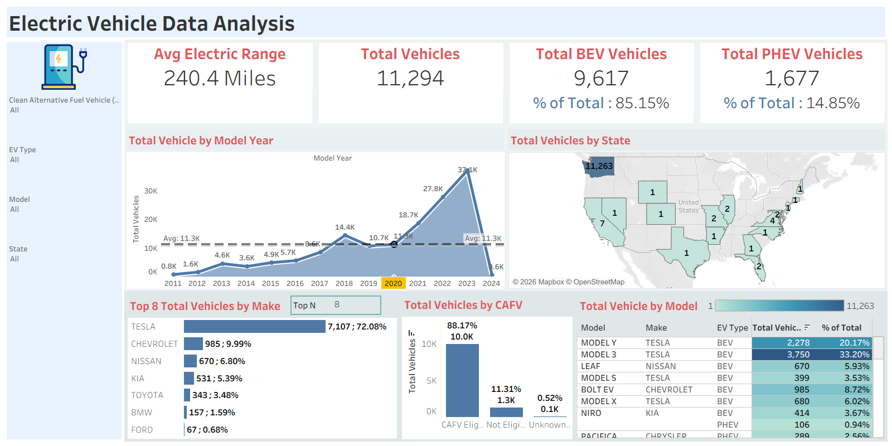

# ⚡ Electric Vehicle Data Analysis Dashboard

An interactive Tableau dashboard for analyzing electric vehicle population, manufacturer trends, and geographic distribution across the United States. Gain insights into EV adoption patterns, vehicle types, CAFV eligibility, and model-level performance across the automotive industry.

---

## 🎯 Purpose

This comprehensive dashboard provides automotive industry stakeholders and policy analysts with deep insights into EV adoption trends, manufacturer dominance, and clean fuel eligibility. It enables data-driven decisions for infrastructure planning, marketing strategy, and policy development by visualizing key metrics from Washington State's EV population data.

---

## 🛠 Tech Stack

- **Data Visualization:** Tableau Desktop
- **Data Processing:** Excel / Power Query
- **Data Source:** Kaggle – Electric Vehicle Population Dataset
- **Dashboard Features:** Interactive Filters, Geographic Map, Dynamic Top N, KPI Cards, Trend Analysis

---

## 📊 Dashboard Overview

### 🏠 Summary KPIs
- Four headline metrics at a glance:
  - **Avg Electric Range** – 240.4 Miles
  - **Total Vehicles** – 11,294
  - **Total BEV Vehicles** – 9,617 (85.15% of total)
  - **Total PHEV Vehicles** – 1,677 (14.85% of total)

---

### 📈 Total Vehicles by Model Year – Trend Analysis
- Year-over-year EV registration trend from **2011 to 2024**
- Clear growth trajectory peaking at **37.1K vehicles in 2023**
- Average benchmark line at **11.3K** for quick comparison
- Highlights the **acceleration in EV adoption post-2020**
- Slight dip in 2024 (0.6K) reflects partial-year data

---

### 🗺️ Total Vehicles by State – Geographic Distribution
- U.S. choropleth map showing EV registrations by state
- **Washington State dominates with 11,263 vehicles**
- Remaining registrations spread across other U.S. states (1–7 vehicles each)
- Useful for identifying infrastructure investment priorities

---

### 🏆 Top 8 Total Vehicles by Make – Manufacturer Ranking
- Adjustable **Top N filter** to customize ranking view
- **Tesla leads with 7,107 vehicles (72.08%)** — far ahead of all competitors
- Rankings:
  1. Tesla – 7,107 | 72.08%
  2. Chevrolet – 985 | 9.99%
  3. Nissan – 670 | 6.80%
  4. Kia – 531 | 5.39%
  5. Toyota – 343 | 3.48%
  6. BMW – 157 | 1.59%
  7. Ford – 67 | 0.68%

---

### 🌱 Total Vehicles by CAFV Eligibility
- Breakdown of Clean Alternative Fuel Vehicle eligibility status:
  - **CAFV Eligible:** 10.0K (88.17%)
  - **Not Eligible:** 1.3K (11.31%)
  - **Unknown:** 0.1K (0.52%)
- Supports policy and incentive planning decisions

---

### 🚘 Total Vehicles by Model – Model-Level Analysis
- Detailed table view with Model, Make, EV Type, Total Vehicles, and % of Total
- **Top Performing Models:**

| Model | Make | EV Type | Total Vehicles | % of Total |
|-------|------|---------|---------------|------------|
| Model 3 | Tesla | BEV | 3,750 | 33.20% |
| Model Y | Tesla | BEV | 2,278 | 20.17% |
| Bolt EV | Chevrolet | BEV | 985 | 8.72% |
| Model X | Tesla | BEV | 680 | 6.02% |
| Leaf | Nissan | BEV | 670 | 5.93% |
| Niro | Kia | BEV | 414 | 3.67% |
| Pacifica | Chrysler | PHEV | 289 | 2.56% |

---

## 💡 Key Insights & Business Impact

### ⚡ EV Adoption & Market Growth
- EV registrations surged dramatically from **2020 onwards**, with 2023 being the peak year
- The data confirms **accelerating consumer adoption** of electric vehicles post-pandemic
- BEV vehicles significantly outpace PHEVs, suggesting preference for fully electric options

### 🏭 Manufacturer & Market Share
- **Tesla's 72% market dominance** signals strong brand loyalty and product-market fit
- Chevrolet and Nissan hold meaningful secondary positions, with room for growth
- Emerging brands like Kia signal **rising competition** in the affordable BEV segment

### 🌍 Geographic & Infrastructure Insights
- Washington State's overwhelming share highlights **regional EV policy effectiveness**
- Sparse registrations in other states indicate **opportunity for infrastructure expansion**
- CAFV eligibility data can guide state-level incentive targeting

### 📋 Policy & Business Intelligence Applications
- **Infrastructure Planning:** Identify high-density EV regions for charging station investment
- **Incentive Strategy:** CAFV eligibility data supports targeted clean fuel policy programs
- **Competitive Benchmarking:** Track manufacturer performance and segment shifts over time
- **Consumer Trend Analysis:** Model year trends inform production and inventory planning

---

## 🚀 Getting Started

### Prerequisites
- Tableau Desktop (free trial at [tableau.com](https://www.tableau.com/))
- Basic understanding of EV industry metrics
- Familiarity with vehicle classification (BEV vs PHEV)

### Usage
1. Download the `.twbx` file from this repository
2. Open with **Tableau Desktop**
3. Use the filter panel (EV Type, Model, State, CAFV) on the left to explore
4. Interact with charts to cross-filter and drill down
5. Hover over map regions and charts for detailed tooltips and metrics

---

## 📸 Dashboard Preview

### Overview Page


---

## 📂 Repository Structure

```
EV-Vehicle-Dashboard/
│
├── EV_VEhicle_Dashboard_2.twbx          # Tableau workbook (open in Tableau Desktop)
├── EV_Vehicle_Insight_Document.rtf      # Detailed analysis & insights document
├── dashboard_preview.png                # Dashboard screenshot
└── README.md                            # Project documentation
```

---

## 👩‍💻 Author

**Janhavi Kotulkar**
📎 [GitHub Profile](https://github.com/janhavikotulkar10311)

---

> ⭐ *If you found this project helpful, feel free to star the repository!*
